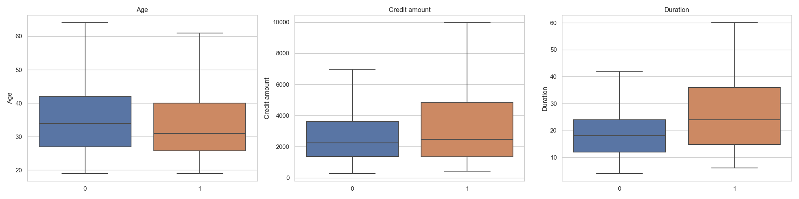
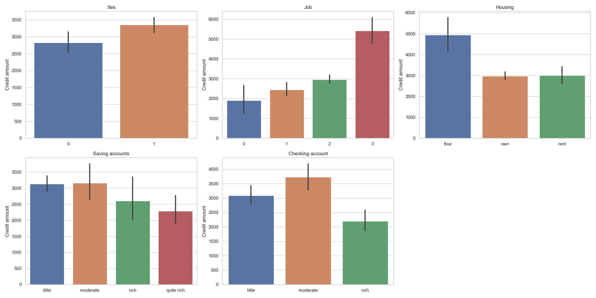
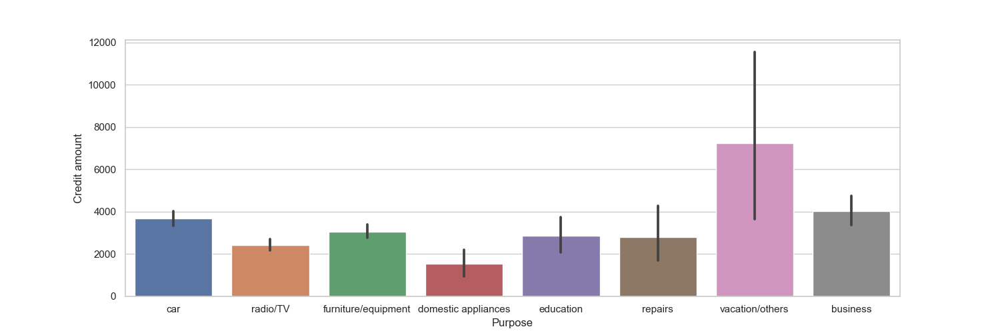
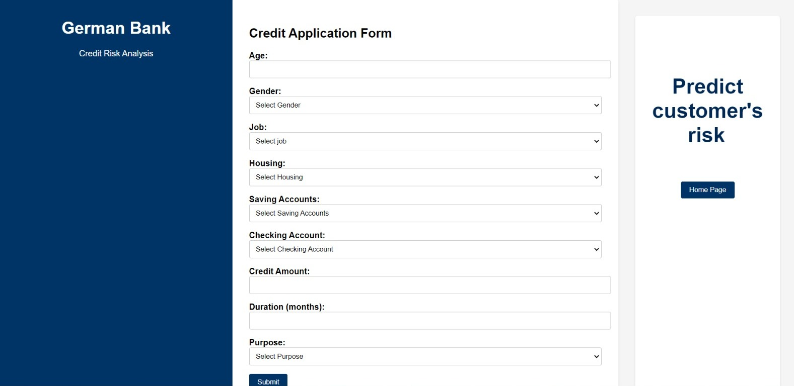

# 德國銀行信用風險預測


## 1. 專案描述
這個專案旨在使用隨機森林模型來預測德國銀行客戶的信用風險。這是一個監督學習分類問題，目標變量是1表示客戶有高風險，0表示客戶風險較低。

我遵循了一些 CI/CD 原則，並使用模塊化編碼的方法進行開發。首先，我在 Jupyter Notebook 中進行了數據分析（EDA）和模型構建。然後，我將項目開發分為數據提取、轉換和模型訓練的組件，並使用這些組件創建了自動化的訓練和預測管道。這些管道能夠自動執行並獲取所有機器學習模型的工件。

此外，我還遵循了一些良好的實踐，例如使用虛擬環境來隔離依賴關係、異常處理、日誌記錄和文檔撰寫。最終，我使用 Flask 構建了一個網頁應用，將上述所有內容集成在一起。我的目標是通過將整個項目打包作為一個包，接近一個真實的數據科學項目工作流程。

## 2. 使用的技術和工具
我們使用了以下技術和工具：
- Python（包括 Pandas、Numpy、Matplotlib、Seaborn、Scikit-Learn、Category-Encoders、Scikit-Optimize、Xgboost 和 Flask）
- Jupyter Notebook
- Git 和 GitHub（版本控制）
- 機器學習分類算法和統計學
- Anaconda（終端）
- Visual Studio Code（開發環境）

## 3. 商業問題和項目目標
德國銀行希望預測其客戶的信用風險，以實現以下目標：
1. 評估風險
2. 提高盈利能力
3. 減少損失
4. 確保合規
5. 進行客戶分群
6. 增強客戶信任

通過使用預測模型，銀行可以做出平衡盈利和風險管理的明智決策，最終使銀行和客戶都受益。項目目標是建立一個模型，能夠識別盡可能多的高風險客戶，並在可用特徵內提供有價值的洞察。

## 4. 解決方案流程
基於 CRISP-DM 框架，我們使用了以下流程：
1. 定義商業問題
2. 收集數據並進行概覽
3. 將數據分為訓練集和測試集
4. 進行探索性數據分析（EDA）
5. 數據清洗和預處理
6. 模型訓練、比較、選擇和調優
7. 最終生產模型測試和評估
8. 得出結論並解釋模型結果
9. 部署

每一步都在筆記本中詳細解釋了決策的合理性。

## 5. 主要商業洞察
1. 年輕客戶的信用風險較高，因為他們通常沒有穩定的收入。
2. 借款金額較高的客戶風險較高，因為借得越多，越難償還。
3. 信用服務持續時間長的客戶風險較高，因為使用時間越長，未還款的風險越大。



4. 信用金額和持續時間強正相關。持續時間長的信用服務通常與較高的信用金額相關。


5. 儲蓄和支票賬戶較少的客戶風險較高。特別是幾乎 50% 的支票賬戶較少的客戶屬於高風險。此外，當客戶為度假或教育目的借款時，風險也較高。


6. 平均而言，擁有高技能工作、免費住房和為度假/其他目的借款的客戶往往借款金額較大，持續時間較長，風險也較高。




## 6. 模型訓練
1. 對分類特徵進行編碼（OrdinalEncoder 和 TargetEncoder），對數值和分類特徵進行標準化（StandardScaler）。
2. 比較多個模型的性能，分析 ROC-AUC 分數。
3. 使用分層交叉驗證選擇最佳模型進行超參數調優和最終評估。
4. 儘管邏輯迴歸的平均驗證分數最好，但我選擇了隨機森林，因為它有更多的性能提升空間。


5. 使用貝葉斯搜索進行隨機森林模型的超參數調優，並定義 class_weight 超參數以更好地學習少數目標類（高風險客戶）的模式。
6. 評估結果並查看精度-召回率權衡。選擇一個能夠提供 0.8 召回率的閾值，最終模型具有令人滿意的結果。

調整精度-召回率前的分類報告：


調整精度-召回率後的分類報告：


7. 通過檢查特徵重要性來解釋模型結果，確認了 EDA 階段的見解。


最終，模型能夠預測 80% 的高風險客戶，有效解決了商業問題。總結來說，為了解決不平衡目標，我實施了分層保持和交叉驗證策略，使用了 class-weight 超參數，並平衡了精度-召回率。

## 7. 網頁應用和下一步
構建了一個 Flask 網頁應用，允許用戶輸入客戶信息並獲取信用風險預測結果。下一步將專注於將該應用部署到雲端，如 AWS。

網頁應用首頁：


網頁應用預測頁面：



## 8. 在本地運行專案
### 先決條件
在開始之前，確保你已經在本地機器上安裝了以下工具：
- Python 3.11.4
- pip（Python 包管理器）
- Git（版本控制工具）

### 操作步驟
1. 克隆倉庫：
   ```bash
   git clone https://github.com/YOUR_GITHUB_USERNAME/Credit-Risk-Prediction-German-Bank.git
2. 導航到克隆的倉庫目錄：
    cd Credit-Risk-Prediction-German-Bank

3. 創建虛擬環境：
python -m venv venv

4. 啟動虛擬環境：
source venv/bin/activate  # 在 Windows 上使用 'venv\Scripts\activate'

5. 運行應用程序：
python application.py

##  9. 數據集來源
數據集來自 Kaggle，屬於 UCI 機器學習庫。
https://www.kaggle.com/datasets/uciml/german-credit

## 10. 聯繫方式
GitHub： https://github.com/liuying1201
Email： liuying1201324@gmail.com


