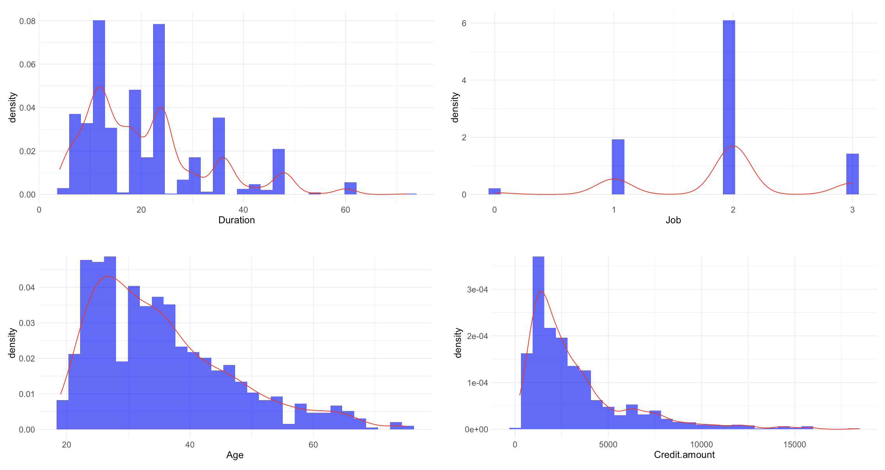
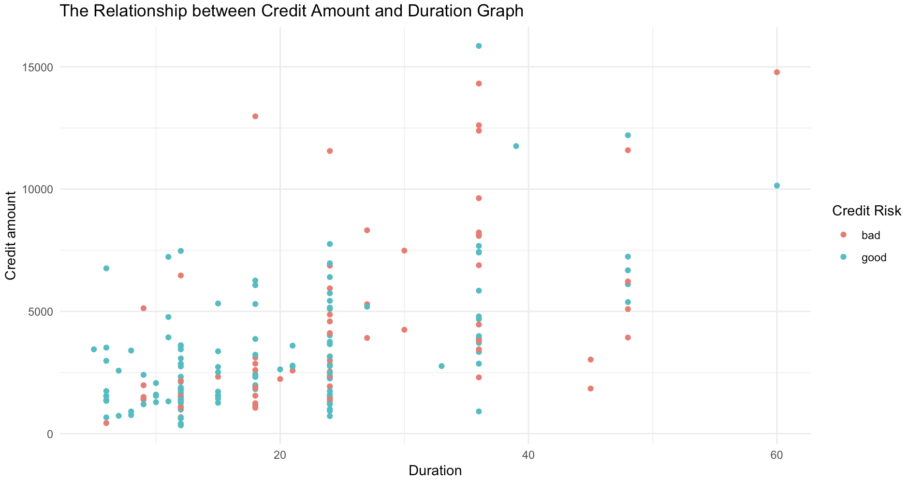
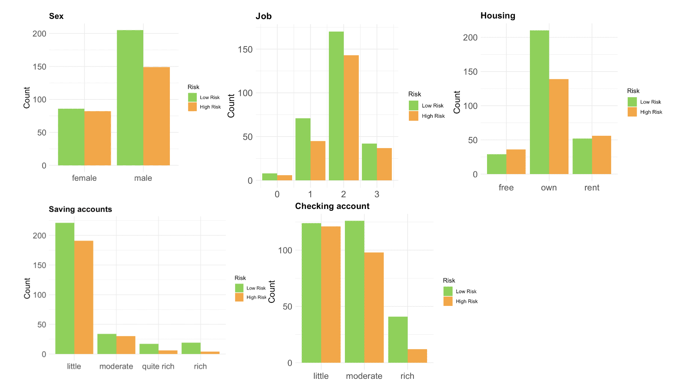

# 德國銀行信用風險預測

## 1. 專案描述
- 銀銀行有一半以上的收益來自於淨利息收入，如何增加放款金額，同時保持低違約率成為銀行重要課題。
- 本專案將應用邏輯迴歸模型預測哪一客戶具有更高的傾向性在銀行貸款上違約。

## 2. 使用的技術和工具
專案使用了以下技術和工具：
- Ｒ studio
- python
- 機器學習分類算法和統計學
- Visual Studio

## 3. 商業問題和項目目標
希望通過預測其客戶的信用風險實現以下目標：
1. 風險評估
2. 提高盈利能力
3. 減少損失
4. 進行客戶分群
5. 增強客戶信任

通過使用預測模型，銀行可以做出平衡盈利和風險管理的明智決策，最終使銀行和客戶都受益。
專案目標是建立一個能夠識別高風險客戶的模型，並提供有價值的洞察。

## 4. 解決方案流程
1. 定義商業問題
2. 收集數據並進行概覽
3. 執行數據探索
4. 數據清洗和預處理
5. 完全數據的建模與解釋
6. 訓練數據和測試數據的模型建構與解釋
7. 預測值驗證
8. 得出結論並解釋模型結果
9. 部署

## 5. 關於數據
1. 此份資料有1000個觀察值，共11個變量，其中假定Risk為目標變量，Risk欄位的0表示低風險，1表示高風險，其餘Age、Sex、Job、Housing、Saving accounts、Checking account、Credit amount、Duration、Purpose為解釋變量。Unnamed: 0為觀察值的序號。

2. 資料描述：
原始資料集包含由Prof. Hofmann準備的1000個條目，包含20個分類/符號屬性。每個條目代表一個向銀行貸款的人，並根據這些屬性分類為良好或不良的信用風險。由於原始數據集的類別和符號系統複雜，難以理解，因此我編寫了一個小型Python腳本將其轉換為可讀的CSV文件。

## 6. 主要商業洞察
1. **年輕客戶風險較高**：年輕客戶通常沒有穩定的收入，信用風險較高。
2. **貸款金額和還款期限強正相關**：從圖形中可以看出，風險與貸款金額和還款期限間確實具有正相關關係，這意味著銀行在審批期限較長和金額較高的貸款時，需要更加謹慎，以降低信用風險。

3. **支票存款與信用風險的負相關**：
回歸係數為負值（-0.38），顯示持有支票存款的客戶與較低的信用風險呈負相關。置信區間不包含零，表明該結果在統計學上具有顯著性。這意味著持有較高支票存款餘額的客戶通常信用風險較低，銀行可相對放心地提供信貸服務。

4. **儲蓄存款帳戶與信用風險的負相關**：
回歸係數為負值（-0.28），顯示儲蓄存款與信用風險呈負相關。置信區間不包含零，表明該結果在統計學上具有顯著性。這意味著持有較高儲蓄帳戶餘額的客戶通常信用風險較低，銀行可更有信心地向此類客戶提供信貸服務。

5. **自有住房降低信用風險**：
回歸係數為負值（-0.30），顯示擁有自有住房的客戶與較低的信用風險呈負相關。置信區間不包含零，表明該結果在統計學上具有顯著性。此結果意味著擁有自有住房的客戶通常信用風險較低，是值得信賴的借貸對象。

6. **就業狀況對信用風險影響不顯著**：
回歸係數為正值（0.09），顯示就業狀況與信用風險的增加有一定的正相關，但置信區間包含零，表明該結果在統計學上不顯著。雖然有工作的客戶信用風險略高，但此關係在統計學上未達顯著，可能需要更多數據來進一步驗證。

7. **女性客戶的信用風險略低但不顯著**：
回歸係數為負值（-0.29），顯示女性客戶的信用風險較低，但置信區間包含零，表明該結果在統計學上不顯著。雖然女性客戶的信用風險略低，但此關係在統計學上未達顯著，可能需要更多數據來進一步分析。

8. **度假或其他非必要用途借款的客戶風險更高**：
假期/其他用途的貸款顯示出較大的高風險區域，這表明貸款用於假期/其他目的的客戶更可能面臨還款困難。銀行應考慮對這些貸款目的進行更嚴格的審核，並可能提高利率或要求更多的抵押品來降低風險。

9. **教育貸款顯示出高風險**：
教育貸款顯示出較大的高風險區域，這可能是因為學生或其家庭的償付能力有限。銀行應針對教育貸款提供更多的支持服務，例如還款計劃和財務教育，以減少壞賬風險。

10. **商業貸款顯示出高風險**：
商業貸款顯示出相對較大的高風險區域，這可能是因為商業活動的不確定性和風險較大。銀行在審批商業貸款時應該更加謹慎，可能需要更詳細的商業計劃和更多的擔保。

11. **汽車和家具/設備貸款顯示出低風險**：
汽車和家具/設備貸款顯示出較大的低風險區域，表明這些用途的貸款風險較低。銀行可以考慮在這些低風險領域加大貸款力度，提供更優惠的貸款條件，吸引更多的優質客戶，從而增加穩定的收入來源。

## 7. 模型訓練
1. **特徵編碼與標準化**  
   我們對分類特徵進行了編碼（使用 OrdinalEncoder 和 TargetEncoder），並對數值和分類特徵進行了標準化處理（使用 StandardScaler）。以下是對各特徵的重要性排序（從高到低）：
   - **Credit amount (借款金額):** 0.3185
   - **Age (年齡):** 0.2426
   - **Duration (還款期限):** 0.1796
   - **Purpose (資金用途):** 0.1044
   - **Checking account (支票存款):** 0.0556
   - **Housing (住房):** 0.0537
   - **Saving accounts (儲蓄存款):** 0.0455
   這表示借款金額 (Credit amount) 和年齡 (Age) 是對模型預測最有影響的特徵，而儲蓄存款 (Saving accounts) 和住房 (Housing) 的影響相對較小。
2. **模型性能比較**  
   我們比較了多個模型的性能，並分析了其 ROC-AUC 分數。
3. **模型選擇與調優**  
   使用分層交叉驗證選擇最佳模型，並進行超參數調優和最終評估。
4. **最佳模型選擇**  
   隨機森林模型的預測能力最佳，因此選擇其作為最終的預測模型。
5. **模型結果解釋**  
   通過檢查特徵重要性來解釋模型結果，並確認了在探索性數據分析（EDA）階段獲得的見解。

最終，模型能夠預測80%的高風險客戶，有效解決了商業問題。

## 8. 結論
通過詳細的數據分析，我們發現了一些影響信用風險的重要因素，如年齡（age）、借款金額(Credit amount)、還款期限(Duration)、支票存款（Checking account）、儲蓄存款（Saving accounts）、住房（Housing）及資金用途（Purpose）。隨機森林模型的使用顯示了良好的預測性能，能夠有效地識別高風險客戶。這不僅有助於銀行做出更明智的貸款決策，還能減少潛在的財務損失。未來，我們可以進一步優化模型並探索更多的特徵，以提高預測的準確性和穩定性。

## 9. 在本地運行專案
### 先決條件
在開始之前，確保你已經在本地機器上安裝了以下工具：
- Python 3.11.4
- pip（Python包管理器）
- Git（版本控制工具）

## 10. 數據集來源
數據集來自Kaggle，屬於UCI機器學習庫：
[German Credit Data](https://www.kaggle.com/datasets/uciml/german-credit)

## 11. 聯繫方式
GitHub：[liuying1201](https://github.com/liuying1201)
Email：liuying1201324@gmail.com

