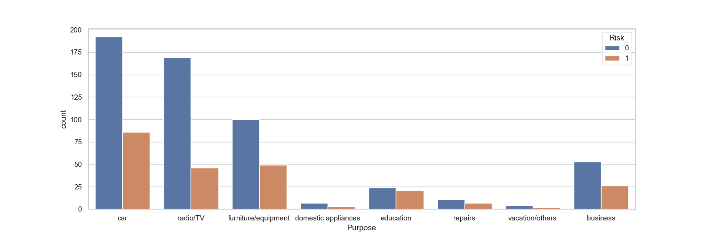
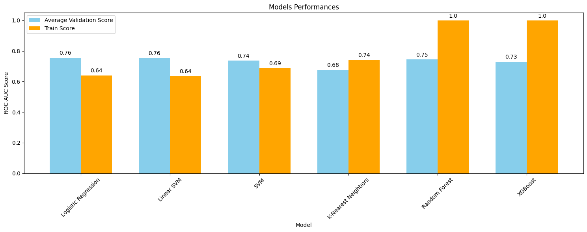
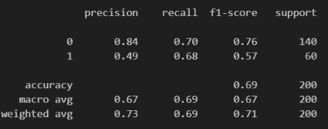
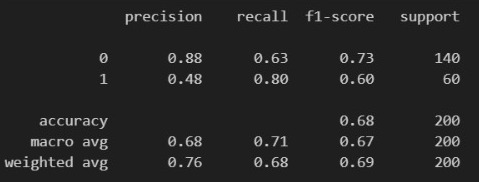
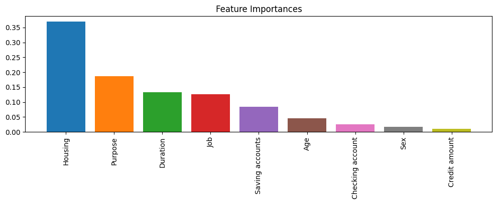

# 德國銀行信用風險預測

## 1. 專案描述
本專案旨在使用隨機森林模型來預測德國銀行客戶的信用風險。這是一個監督學習的分類問題，目標變量為1表示高風險，0表示低風險。

## 2. 使用的技術和工具
專案使用了以下技術和工具：
- Ｒ studio
- 機器學習分類算法和統計學

## 3. 商業問題和項目目標
德國銀行希望通過預測其客戶的信用風險實現以下目標：
1. 風險評估
2. 提高盈利能力
3. 減少損失
4. 確保合規
5. 進行客戶分群
6. 增強客戶信任

通過使用預測模型，銀行可以做出平衡盈利和風險管理的明智決策，最終使銀行和客戶都受益。專案目標是建立一個能夠識別高風險客戶的模型，並提供有價值的洞察。

## 4. 解決方案流程
基於CRISP-DM框架，使用以下流程：
1. 定義商業問題
2. 收集數據並進行概覽
3. 將數據分為訓練集和測試集
4. 進行探索性數據分析（EDA）
5. 數據清洗和預處理
6. 模型訓練、比較、選擇和調優
7. 最終生產模型測試和評估
8. 得出結論並解釋模型結果
9. 部署

## 5. 主要商業洞察
1. **年輕客戶風險較高**：年輕客戶通常沒有穩定的收入，信用風險較高。
2. **貸款金額和持續時間強正相關**：從圖形中可以看出，貸款金額和持續時間確實具有正相關關係，這意味著銀行在審批期限較長和金額較高的貸款時，需要更加謹慎，以降低信用風險。

5. **儲蓄和支票賬戶較少風險較高**：特別是幾乎50%的少量支票賬戶客戶屬於高風險。此外，當客戶為度假或教育目的借款時，風險也較高。
6. **高技能工作和免費住房風險較高**：擁有高技能工作、免費住房的客戶，借款金額較大，持續時間較長，這些因素使得他們的信用風險較高。

7. **度假或其他非必要用途借款的客戶風險更高**：度假或其他非必要用途借款的客戶，通常風險更高，因為這些借款往往涉及較大的金額和較長的償還期。

## 6. 模型訓練
1. 對分類特徵進行編碼（OrdinalEncoder 和 TargetEncoder），對數值和分類特徵進行標準化（StandardScaler）。
2. 比較多個模型的性能，分析ROC-AUC分數。
3. 使用分層交叉驗證選擇最佳模型進行超參數調優和最終評估。
4. 儘管邏輯迴歸的平均驗證分數最好，但我選擇了隨機森林，因為它有更多的性能提升空間。

5. 使用貝葉斯搜索進行隨機森林模型的超參數調優，並定義class_weight超參數以更好地學習少數目標類（高風險客戶）的模式。
6. 評估結果並查看精度-召回率權衡。選擇一個能夠提供0.8召回率的閾值，最終模型具有令人滿意的結果。

調整精度-召回率前的分類報告：

調整精度-召回率後的分類報告：

7. 通過檢查特徵重要性來解釋模型結果，確認了EDA階段的見解。

最終，模型能夠預測80%的高風險客戶，有效解決了商業問題。總結來說，為了解決不平衡目標，我實施了分層保持和交叉驗證策略，使用了class-weight超參數，並平衡了精度-召回率。

## 7. 結論
本專案展示了如何使用機器學習技術來預測德國銀行客戶的信用風險。通過詳細的數據分析和模型構建，我們發現了一些影響信用風險的重要因素，如年齡、借款金額和信用服務的持續時間。隨機森林模型的使用顯示了良好的預測性能，能夠有效地識別高風險客戶。這不僅有助於銀行做出更明智的貸款決策，還能減少潛在的財務損失。未來，我們可以進一步優化模型並探索更多的特徵，以提高預測的準確性和穩定性。

## 8. 在本地運行專案
### 先決條件
在開始之前，確保你已經在本地機器上安裝了以下工具：
- Python 3.11.4
- pip（Python包管理器）
- Git（版本控制工具）

## 9. 數據集來源
數據集來自Kaggle，屬於UCI機器學習庫：
[German Credit Data](https://www.kaggle.com/datasets/uciml/german-credit)

## 10. 聯繫方式
GitHub：[liuying1201](https://github.com/liuying1201)
Email：liuying1201324@gmail.com

