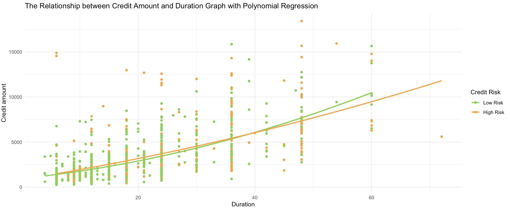

# 德國銀行信用風險預測

## 1. 專案描述

銀行有一半以上的收益來自淨利息收入，如何增加放款金額並同時保持低違約率，成為銀行的重要課題。本專案旨在使用機器學習模型，通過分析客戶特徵，預測客戶的信用風險高低，從而協助銀行進行風險管理和授信決策。

## 2. 使用的技術與工具

本專案使用了以下技術與工具：
- **R Studio**
- **Python**
- **機器學習分類算法**
- **統計學**
- **Visual Studio**

## 3. 商業問題與項目目標

本專案希望通過預測客戶的信用風險，實現以下目標：
1. **風險評估**
2. **提高盈利能力**
3. **減少損失**
4. **客戶分群**
5. **增強客戶信任**

通過使用預測模型，銀行可以在盈利與風險管理之間做出明智的決策，最終使銀行與客戶雙方受益。專案的目標是建立一個能夠識別高風險客戶的模型，並提供有價值的洞察。

## 4. 解決方案流程

1. **定義商業問題**
2. **收集數據並進行概覽**
3. **執行數據探索**
4. **數據清洗與預處理**
5. **完整數據的建模與解釋**
6. **訓練數據與測試數據的模型建構與解釋**
7. **預測值驗證**
8. **結論與模型結果解釋**
9. **部署**

## 5. 關於數據

1. **資料概述**：此數據集包含1000個觀察值，共11個變量。其中，Risk為目標變量，0表示低風險，1表示高風險。其他變量包括Age、Sex、Job、Housing、Saving accounts、Checking account、Credit amount、Duration、Purpose等。

2. **資料描述**：原始資料集由Prof. Hofmann準備，包含1000個條目和20個分類/符號屬性。每個條目代表一個向銀行貸款的個人，並根據這些屬性被分類為良好或不良的信用風險。由於原始數據集的類別和符號系統較為複雜且難以理解，因此我編寫了一個小型Python腳本將其轉換為可讀的CSV文件。

## 6. 主要商業洞察

1. **年輕客戶風險較高**：年輕客戶通常收入不穩定，信用風險較高。
2. **貸款金額與還款期限正相關**：風險與貸款金額和還款期限間存在正相關，這意味著銀行在審批高額與長期貸款時需更謹慎。

3. **支票存款與信用風險負相關**：持有支票存款的客戶與較低的信用風險呈負相關，且此結果在統計上顯著。
4. **儲蓄存款帳戶與信用風險負相關**：儲蓄存款餘額較高的客戶通常信用風險較低，此結果也在統計上顯著。
5. **自有住房降低信用風險**：擁有自有住房的客戶信用風險較低，這一結果在統計上顯著。
6. **就業狀況對信用風險影響不顯著**：雖然有工作的客戶信用風險略高，但此關係在統計上未達顯著。
7. **女性客戶信用風險略低但不顯著**：女性客戶的信用風險略低，但此關係在統計上未達顯著。

8. **汽車貸款風險較低**：
   - 汽車貸款在高風險類別中的實際貸款數量低於預期，顯示出相對較低的信用風險。
   - 這表明該類貸款具有風險可控性，可作為穩健的貸款產品進行推廣，可考慮推出更多優惠條件的產品，以吸引更廣泛的借款人群體，並擴大市場佔有率。
9. **家具/設備貸款風險較高**：
   - 家具/設備用途的貸款顯示出較高的信用風險。
   - 金融機構需對該類貸款採取更為嚴格的風險管理措施，以降低潛在風險。可能需要重新評估授信標準，或設計針對性的風險緩解措施，例如提高保證金或風險溢價。
10. **教育和家用電器貸款相對穩定**：
   - 教育和家用電器用途的貸款風險分佈均衡，顯示出較低的信用風險。這些用途的貸款適合納入低風險投資組合，並可以提供優惠條件吸引借款人。
11. **商業貸款風險均衡**：
   - 商業用途貸款的風險分佈較為均衡，無顯著偏差。該類貸款產品可持續保持穩定的風險評估標準，支持中小企業的發展。

## 7. 模型訓練

1. **特徵選擇**：計算每個特徵與目標變量Risk之間的相關性，選擇相關性大於0.1的特徵作為模型輸入特徵。
2. **數據平衡**：使用SMOTE（合成少數類別過採樣技術）處理數據集中的類別不平衡問題。
3. **特徵編碼與標準化**：進行數據標準化處理，並通過多項式特徵變換生成特徵交互項，提升模型表現。
4. **特徵選擇**：使用隨機森林模型對特徵進行選擇，保留對模型預測貢獻最大的特徵。
5. **模型性能比較**：比較多個模型的性能，並分析其ROC-AUC分數。
6. **模型選擇與調優**：使用分層交叉驗證選擇最佳模型，並進行超參數調優和最終評估。
7. **最佳模型選擇**：選擇隨機森林模型，並通過集成學習技術（堆疊分類器）進一步提升模型準確性。模型使用平衡的類別權重來處理類別不平衡問題。

### 模型在測試集上的表現如下：
- **Accuracy**: 0.70
- **Precision**: 0.72（低風險類別），0.67（高風險類別）
- **Recall**: 0.67（低風險類別），0.72（高風險類別）
- **F1-Score**: 0.70（低風險類別），0.70（高風險類別）

這些圖表顯示了模型在區分高風險和低風險客戶時的表現。ROC曲線顯示模型的區分能力良好，AUC為0.78，表示模型在識別不同風險級別方面有不錯的效果。Precision/Recall曲線反映了模型在高召回率時的精度下降，說明模型在識別高風險客戶時能夠捕捉到更多的目標，但精度有所降低。總體來看，模型在信用風險預測方面表現穩定，適合在需要權衡風險識別與預測精度的應用場景中使用。

## 8. 結論
本專案成功運用機器學習技術分析了影響客戶信用風險的主要因素，並構建了實用的預測模型。研究顯示，年齡、貸款金額、還款期限、存款餘額和住房狀況等變量在信用風險評估中具有重要作用。隨機森林模型在測試集上表現良好，有助於銀行更準確地進行風險管理和貸款決策，從而提升盈利能力並增強客戶信任。

## 9. 未來工作
未來可進一步優化特徵工程，探索更多潛在特徵交互作用，以提升模型準確性。同時，可引入如SHAP或LIME等技術增強模型解釋性，並嘗試其他集成學習方法提升模型穩定性，進一步加強模型在銀行信用風險管理中的應用價值。

## 10. 數據集來源
數據集來自Kaggle，屬於UCI機器學習庫：
[German Credit Data](https://www.kaggle.com/datasets/uciml/german-credit)

## 11. 聯繫方式
GitHub：[liuying1201](https://github.com/liuying1201)
Email：liuying1201324@gmail.com

